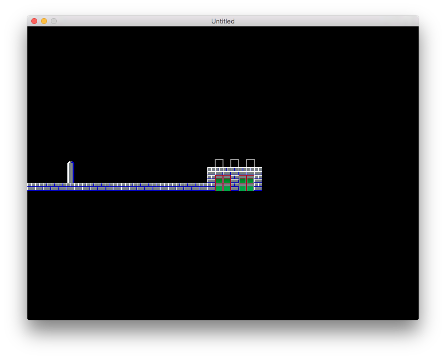

```
|    o|
|--- .|    ,---.,-.-.,---.
|    ||    |---'| | ||   |
`---'``---'`---'` ' '|---'
                     |
```
*minimal ASCII tilemap loader*

# What
A tilemap loader made primarily for Love2D. Loads a text file with the map defined and loads the images for you.

# Why
I'm not a fan of any of the free tile editors, and spend 90% of my time in a text-only environment (terminal). Thus, writing tilemaps in a simple *human readable* text file makes more sense to me.

# How

First, load it.
```lua
tilemp = require 'tilemp'
```

Then bind characters to image quads/actions:

```lua
tilemp.bind('#', tilesheet, love.graphics.newQuad(0, 16, 16, 16, tilesheet:getDimensions()))

-- or

tilemp.bind('e', function(x, y)
    e = spawn_enemy()
    e:move(x * e.w, y * e.h)
    table.insert(enemies, e)
end
```

Parse the file:
```lua
tilemp.parse('mymapfile.txt')
```

Draw image tilemaps:
```lua
function love.draw()
    -- ...
    tilemp.drawTiles()
    -- ...
end
```

And voila!


See `t/main.lua` for a full example file.

### Credits
Got the tiles here: http://erik-red.deviantart.com/art/volt-man-tile-sheet-93647336
